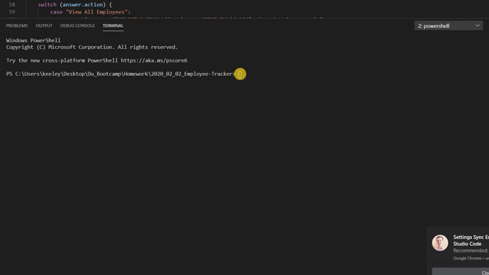
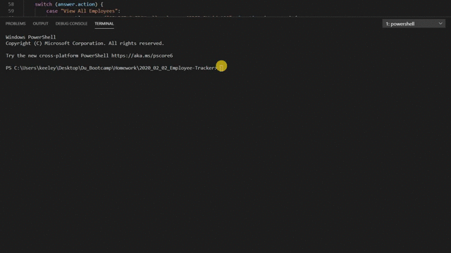
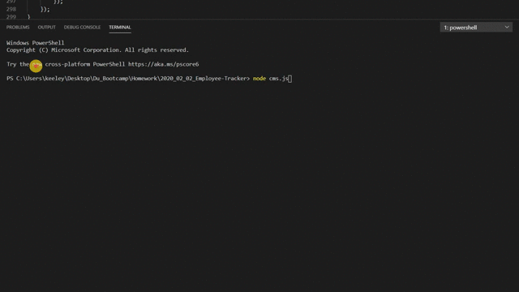

# Employee Management System
This was created for a web development bootcamp. This simple command-line application allows users to add, view and update employees. Watch the gifs below to see how it works.

## Utilizing
* Node
* Inquirer
* MySQL
* CTable

## VIEW

## ADD

## UPDATE
